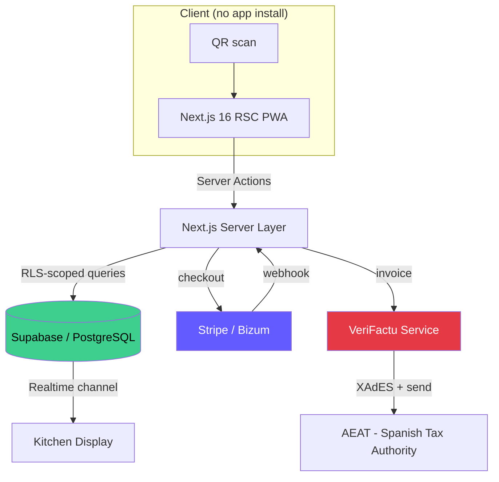
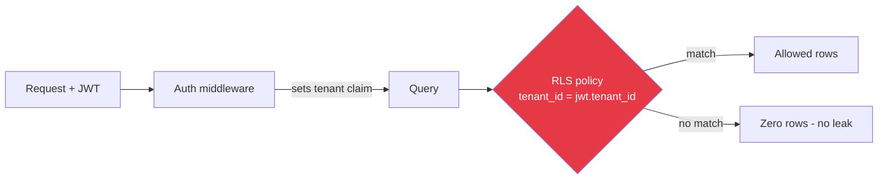

# Barista — Architecture Case Study

**Multi-tenant SaaS for hospitality: QR ordering, real-time kitchen, fiscal-compliant payments.**

> This repository documents the **architecture and engineering decisions** behind a production SaaS.
> No proprietary source code or secrets are published — it is a system-design write-up.

---

## The problem

Restaurants and bars want customers to scan a QR at the table, order, and pay — without an app install, without a waiter bottleneck, and **with legally valid Spanish invoicing** (RD 1007/2023 / VeriFactu).

Hard constraints:

1. **Multi-tenant**: hundreds of venues, strict data isolation. A bug must never leak venue A's orders to venue B.
2. **Real-time**: kitchen display and table status update in < 1 s.
3. **Fiscal compliance**: every paid order emits a tamper-evident invoice to the Spanish tax authority (AEAT).
4. **No app**: pure web, fast on a cheap phone over 3G.
5. **Self-serve onboarding**: a venue signs up and is operational the same day.

---

## High-level architecture

---

## Key engineering decisions

### 1. Tenant isolation via PostgreSQL Row Level Security

Instead of a `WHERE tenant_id = ?` scattered across the codebase (one missed clause = data leak), isolation is enforced **at the database**:

- Every tenant-owned table has a non-null `tenant_id`.
- RLS is `ENABLED` and `FORCED` on every such table.
- Policies filter on `auth.jwt() ->> 'tenant_id'` — the application *cannot* bypass them, even with a buggy query.
- Service-role operations (webhooks, cron) use a separate, audited path.

> Lesson: pushing the security invariant into the database turns a *whole class* of application bugs into a non-issue. Application code can be wrong and data stays isolated.

### 2. Server Components first, Client Components only where needed

Next.js 16 App Router. Default to **React Server Components**:

- Menus, order history, dashboards → RSC, zero JS shipped.
- Interactive bits (cart, live kitchen board) → Client Components, hydrated selectively.
- Mutations through **Server Actions** — no hand-written API layer for internal flows; validation with a typed schema at the boundary.

Result: tiny client bundle, fast first paint on cheap phones — the actual deployment target.

### 3. Payments: Stripe + Bizum, idempotent webhooks

- Checkout created server-side; client never sees secret keys.
- **Webhook signature verified** before any state change.
- **Idempotency**: every webhook keyed by event id; replays are no-ops. A double-delivered `payment_intent.succeeded` never double-charges or double-invoices.
- Payment state machine: `pending → paid → invoiced → settled`, each transition logged.

### 4. Fiscal compliance (VeriFactu / RD 1007/2023)

Spain's anti-fraud law requires invoices to be **chained and tamper-evident**, signed and reported to AEAT.

- A dedicated VeriFactu service owns invoice generation and the hash chain.
- Each invoice references the hash of the previous one — breaking the chain is detectable.
- XAdES signing + AEAT submission isolated behind an interface, so test/sandbox vs. production (`compliant`) mode is a single guarded switch — never flipped without a real certificate present.

> Compliance is treated as a **safety-critical subsystem**: it fails closed, never silently.

### 5. Real-time without a custom socket server

Supabase Realtime channels push order/table state to the kitchen display. No bespoke WebSocket infra to operate — the database *is* the event bus, scoped by the same RLS policies.

---

## Tech stack

| Layer | Choice | Why |
|-------|--------|-----|
| Frontend | Next.js 16 (App Router, RSC), React 19 | Minimal client JS, server-first |
| Styling | Tailwind | Fast, consistent, no runtime cost |
| i18n | Per-locale routing + message catalogs | ES / EN venues from day one |
| Data | Supabase (PostgreSQL) | Managed Postgres + Realtime + Auth |
| ORM | Drizzle | Typed SQL, migrations as code |
| Isolation | PostgreSQL RLS (forced) | DB-enforced multi-tenancy |
| Payments | Stripe + Bizum | Card + Spanish instant payment |
| Compliance | VeriFactu service (XAdES → AEAT) | RD 1007/2023 |
| Deploy | Docker, blue/green behind nginx | Zero-downtime releases |

---

## Hard problems solved

| Problem | Approach |
|---------|----------|
| Cross-tenant data leak risk | RLS `FORCED` + JWT tenant claim — invariant in DB, not app |
| Double charge on webhook replay | Event-id idempotency keys + state machine |
| Invoice tampering | Hash-chained invoices, signed, fail-closed compliance mode |
| Slow phones on 3G | RSC-first, near-zero client bundle for read paths |
| Same-day venue onboarding | Self-serve signup provisions tenant + RLS scope automatically |
| Zero-downtime deploys | Blue/green containers, nginx flip, immutable images |

---

## What I'd do next

- [ ] Per-tenant rate limiting at the edge
- [ ] Read replicas for analytics workloads
- [ ] Offline-first cart (Service Worker) for flaky venue Wi-Fi
- [ ] Contract tests against the AEAT sandbox in CI
- [ ] OpenTelemetry traces across order → payment → invoice

---

## About

This is a **sanitized architecture write-up** of a real production system I designed and built. Source code and infrastructure remain private; this document exists to show how I reason about **multi-tenancy, compliance, payments and performance** under real constraints.

Related public work: [VeriStack](https://github.com/franamaro-dev/VeriStack) · [VeriFactu-Integrity-Lab](https://github.com/franamaro-dev/VeriFactu-Integrity-Lab) · [Store-Inventory-API](https://github.com/franamaro-dev/Store-Inventory-API)

---

Written by [Francisco Amaro](https://github.com/franamaro-dev) — Backend Engineer & SOC L1 Analyst
[LinkedIn](https://linkedin.com/in/franamaro) · [Email](mailto:franamaroprieto@gmail.com)

